# Noosphere

**Physics-informed world model agent with multimodal perception, brain-computer interface support, and general-purpose task execution.**

---

## What it is

Noosphere is a system that closes the loop between human thought and action — physical or digital.

A person wearing three EEG electrodes on the back of their neck thinks about doing something. The system reads the neural signal, decodes the intent, observes the environment, builds an internal model of what will happen if it acts, plans the best action, executes it, and learns from the outcome.

The same model can command a robotic arm or run a Linux shell command. The world model is domain-agnostic. Only the action vocabulary and executor change.

**Core loop:**

```
Perceive → Model → Plan → Act → Observe → Learn → Repeat
```

Everything runs onboard. No data leaves the device.

---

## What it does

**Physical:** EEG intent → coordinate prediction → inverse kinematics → collision-free path → servo commands

**Digital:** EEG intent → world model planning → action vocabulary → shell command → structured outcome → world model update

**Both simultaneously** if needed: the same agent can control an arm while monitoring a terminal process.

---

## Architecture

### Three perception streams, always early-fused

```
Any subset of sensors is valid. Missing streams are masked — not zero-padded.
EEG-only, vision-only, kinematics-only all work correctly.

Sensors
   │
   ├── RGB · depth · stereo · LiDAR · audio    → patch tokenizer   (Stream A)
   ├── EEG — 3 neck electrodes @ 256 Hz        → S4 SSM            (Stream B)
   └── joints · IMU · force/torque             → learned-adj GNN   (Stream C)

Token sequence:
   [CLS | S4_tok | GNN_tok | vis_patch_1 ... vis_patch_N]

   Absent streams: tokens are present but fully masked in attention.
   No zero-noise leaks into present-stream embeddings.

All tokens attend to all other tokens from layer 1.
```

**Stream A — Patch Tokenizer:** ViT-style patch embedding for spatial data. New modalities register at runtime via `register_modality()`.

**Stream B — S4 SSM:** EEG processed sample-by-sample. No windowing. Continuous-time ODE with HiPPO-LegS initialization preserves sub-window structure (P300 ERPs, muscle onset transients). FFT convolution during training `O(L log L)`, single recurrence at inference `O(N)`.

EEG electrode placement: three electrodes on the posterior neck (C7). Neck EMG is the signal, not noise. `MuscleArtifact` with `action=Intentional` is published downstream. The S4 encoder decodes motor intent (5 classes) and cognitive state (workload, attention, arousal, valence, fatigue) as auxiliary heads.

**Stream C — Learned-Adjacency GNN:** Joint states as graph nodes. Edges learned from data, not hardcoded. Sparsity regularization drives topology toward actual physical coupling structure.

### Four fusion strategies

```
Layer 0: Strategy 1 — single injection   (S4+GNN summaries prepended as tokens)
Layer 1: Strategy 3 — cross-attention    (transformer Q → S4 sequence, GNN nodes)
Layer 2: Strategy 2 — multi-scale inject (S4+GNN re-injected via gated residual)
Layer 3: Strategy 3 — cross-attention
Layer 4: Strategy 2 — multi-scale inject
Layer 5: Strategy 3 — cross-attention
```

Strategy 4 (gated fusion `γ = σ(W[pool_q; pool_kv])`) is embedded in every injection point. If visual tokens already explain the state, the gate suppresses EEG/GNN contributions automatically.

### Physics-Augmented RSSM

Latent state `sₜ = (hₜ, zₜ)`:
- `hₜ` — deterministic GRU state (long-range temporal dependencies)
- `zₜ` — stochastic discrete categorical latent (uncertainty, multimodal futures)

**Physics transition prior — hard-coded RK4 ODE:**
```
v̇ = (F_ext + F_grav + F_drag + F_contact) / m   (Kelvin-Voigt contact)
ω̇ = I⁻¹(τ - ω × Iω)                             (Euler rotation)
q̇ = ½ q ⊗ [0, ω]                                 (quaternion, no gimbal lock)
∂u/∂t ≈ ν∇²u                                     (coarse Navier-Stokes)
```

Neural **residual corrector** learns only `Δs = s_actual - s_physics`. Five conservation law losses (energy, momentum, angular momentum, quaternion unit norm, incompressibility) enforce physical consistency as hard constraints.

### Planning

World model is frozen during planning — it acts as a simulator, never the real environment.

**MCTS in latent space:**
```
Select   → UCB: Q(s,a) + c · P(a|s) · √Σn_parent / (1 + n_a)
Expand   → imagine_step(h, z, a) for each action
Evaluate → imagined rollout to horizon H, bootstrap with value head
Backup   → propagate value up the path
```

BCI intent seeds the root prior. Cognitive budget scaling:
```
n_sims = max(5, n_sims_base × (1 - 0.4·workload - 0.4·fatigue))
```

**Actor-Critic** on H=15 imagined rollouts via TD(λ), clipped double-Q critic.

**π-StepNFT** (arxiv:2603.02083): critic-free alternative. Labels imagined trajectories positive (successful reach) or negative (collision/IK failure). Step-wise log-probability ratio as implicit advantage. No value network. Single forward pass per update.

### Act phase bridge

```
MCTS integer
     │
     ▼
ActionSpace.lookup(idx) → Action(name, description, payload)
     │
     ▼
ActBridge.act()  ← confidence gate (predicted_value > min_confidence)
     │
     ├─ ApparatusExecutor  → joint deltas → IK → collision check → servo
     ├─ ShellExecutor      → subprocess.run() → exit code, stdout features
     └─ NullExecutor       → no-op (testing, dry runs)
     │
     ▼
Structured observation → agent.observe() → replay buffer → world model trains
```

The world model learns to predict outcomes in latent space. During planning it *imagines* running a command. At Act, it runs it once. The feedback closes the loop.

### Three learning modes

**Supervised** — labeled (EEG features, kinematic/outcome target) pairs. MSE + IK feasibility penalty. Used for initial bootstrap from demonstrations.

**Unsupervised (NT-Xent)** — contrastive EEG pre-training. Two augmented views (time shift, amplitude jitter, channel dropout, band mask) → similar embeddings. No labels required. Runs continuously.

**Reinforcement (π-StepNFT)** — step-wise negative-aware fine-tuning. Positive trajectories: clean reach, successful command. Negative: IK failure, non-zero exit code, collision. No critic network.

### Communication protocol (NCP)

Compact binary inter-module protocol. Not JSON. Not protobuf.

```
Frame: [MAGIC 1B][VER 1B][TYPE 1B][FLAGS 1B][SEQ 2B][PLEN 2B][PAYLOAD NB][CRC-16 2B]
```

| Message | NCP | JSON est. | Reduction |
|---|---|---|---|
| EEG_SEGMENT | 84 B | ~820 B | 90% |
| DESTINATION | 22 B | ~120 B | 82% |
| MOTOR_CMD | 35 B | ~200 B | 82% |

At 256 Hz: 21 KB/s vs 210 KB/s. CRC-16/CCITT-FALSE over full frame.

---

## Quick start

```bash
pip install torch numpy scipy scikit-learn
python demo.py --smoke              # all domains, all sensor subsets
python demo.py --partial            # EEG-only, vision-only, mixed — verify masking
python demo.py --shell              # EEG → world model → Linux commands
python demo.py --train --steps 200  # continuous training on synthetic BCI env
python demo.py --apparatus          # full BCI → IK → motor pipeline
python demo.py --proto              # NCP round-trip test
python demo.py --domain bci         # BCI domain with world model
python demo.py --profile            # latency breakdown per stream
```

---

## Installation

```bash
git clone https://github.com/yourhandle/noosphere
cd noosphere
pip install -r requirements.txt
```

Optional hardware backends:
```bash
pip install rppal pwm-pca9685    # Raspberry Pi + PCA9685
pip install pyserial             # Arduino serial
pip install redis                # Redis transport for NCP
```

---

## Usage

### Partial sensor input (any subset works)

```python
from noosphere import NoosphereAgent, AgentConfig

cfg   = AgentConfig(n_actions=6, n_eeg_ch=3, n_nodes=6)
agent = NoosphereAgent(cfg, device=torch.device("cpu"))

# All of these are valid — missing streams are masked, not zero-padded
agent.step({"eeg": eeg_array})                           # EEG only
agent.step({"rgb": rgb, "depth": depth})                 # vision only
agent.step({"kinematics": joints})                       # kinematics only
agent.step({"eeg": eeg, "rgb": rgb})                     # EEG + vision
agent.step({"eeg": eeg, "rgb": rgb, "kinematics": k})    # all three
```

### Physical apparatus control

```python
from noosphere.apparatus import IntentionFilter, AnomalyDetector, MovementExecutor
from noosphere.hardware  import ServoController

filt     = IntentionFilter()
anomaly  = AnomalyDetector()
executor = MovementExecutor()
servo    = ServoController(backend="rpi_pca9685")

for segment in eeg_stream:
    if filt.is_intentional(segment) and anomaly.update_and_check(segment["probabilities"]):
        target = predictor.predict(CoordinatePredictor.extract_features(segment))
        for angles_deg in executor.plan_and_execute(target):
            servo.smooth_move(angles_deg)
```

### Digital task execution

```python
from noosphere.actions import make_shell_space, ShellExecutor, ActBridge

space    = make_shell_space(working_dir=".")
executor = ShellExecutor(
    allow_list=["ls","pwd","git","python3"],  # start read-only
    timeout_s=30.0,
)
bridge   = ActBridge(space, executor, min_confidence=0.4)

cfg   = AgentConfig(n_actions=space.n_actions, n_eeg_ch=3)
agent = NoosphereAgent(cfg, device)
agent.act_bridge = bridge  # attach before stepping

obs     = {"eeg": eeg_array, "electrode_mask": np.ones(3)}
action, info = agent.step(obs)
# info["act_executed"], info["act_outcome"], info["act_reward"]
agent.observe(obs, action, info.get("act_reward", 0.0), done, info=info)
```

### Continuous training

```python
from noosphere.trainer import Trainer, TrainerConfig, Env

class MyEnv(Env):
    def reset(self):
        return {"eeg": initial_eeg}

    def step(self, action, act_result=None):
        obs    = {"eeg": next_eeg}
        reward = compute_reward(action, act_result)
        done   = check_terminal()
        return obs, reward, done, {}

trainer = Trainer(
    agent,
    MyEnv(),
    TrainerConfig(
        checkpoint_dir="checkpoints",
        checkpoint_every=500,
        log_every=10,
    )
)
trainer.run()          # runs until Ctrl-C, saves checkpoint on exit
trainer.run(n_steps=1000)  # fixed budget
```

### Resuming from checkpoint

```python
from noosphere.trainer import load_checkpoint
step = load_checkpoint(agent, "checkpoints/step_0001000.pt")
```

### Expanding the shell vocabulary

```python
space = make_shell_space()

# Add new commands as the agent proves reliable on the base set
space.add("run_tests",   "Run project test suite",    payload={"cmd": "python -m pytest"})
space.add("git_pull",    "Pull latest changes",        payload={"cmd": "git pull"})
space.add("pip_install", "Install dependencies",       payload={"cmd": "pip install -r requirements.txt"})

# Update the agent's action space size
cfg   = AgentConfig(n_actions=space.n_actions)
agent = NoosphereAgent(cfg, device)
agent.act_bridge = ActBridge(space, ShellExecutor(allow_all=True))
```

### Adding a new sensor modality

```python
from noosphere.tokenizer import ImagePatchTokenizer

agent.perception.tokenizer.register_modality(
    "thermal",
    ImagePatchTokenizer(in_channels=1, d_model=cfg.d_model, patch_size=8)
)
obs = {"thermal": thermal_array, "eeg": eeg_array}  # works immediately
```

### Real-world sensor integration

```python
# EEG hardware — any amplifier returning (3, T) float32 in microvolts
raw = amp.read_samples(256)
obs = {"eeg": raw, "electrode_mask": np.ones(3)}

# Depth camera for obstacle avoidance
depth = camera.get_depth_frame()
executor.obstacles.update_from_depth(depth, K=intrinsics, T_cam_world=pose)

# Anything with (T, F) output works as "structured"
obs["structured"] = imu.read()   # IMU, pressure, process metrics, etc.
```

---

## Supported domains

| Domain | Actions | Primary sensors |
|---|---|---|
| Drone | 6 | RGB, depth, IMU |
| Legged locomotion | 12 | Stereo RGB, joint state (30 DOF) |
| Manipulation | 8 | RGBD, force-torque |
| BCI apparatus | 5 intent classes | 3-ch neck EEG, visual feedback |
| Fluid / soft-body | 4 | RGB, pressure array |
| Linux shell | N (vocabulary size) | EEG, structured (process state) |

---

## Training

### Phase A — World model (real data from replay buffer)
```
L = λ_KL · KL(q‖p)  +  λ_r · ‖Dec(s) - e‖²  +  λ_rew · ‖f_r(s) - r‖²
  + BCE(f_d(s), done)  +  λ_phys · L_conservation
```

### Phase B — Policy (imagination, world model frozen)
```
TD(λ): Gₜ = rₜ + γ[(1-λ)Vₜ₊₁ + λGₜ₊₁]
π-StepNFT: L = -β · Σₜ wₜ · [log π(aₜ|sₜ)⁺ - log π(aₜ|sₜ)⁻]
```

### Phase C — Contrastive EEG (always running, no labels)
```
L = NT-Xent(encoder(aug₁(eeg)), encoder(aug₂(eeg)))
```

Warmup: 1000 Phase A steps before Phase B begins.
Reward signal for digital tasks: exit code 0 → +0.5, non-zero → -0.2, timeout → -0.5.
Executor feedback blends with environment reward: `r = 0.7·env_r + 0.3·exec_r`.

---

## Project structure

```
noosphere/
├── __init__.py       public API — all exports
├── agent.py          NoosphereAgent — step / observe / update + ActBridge wiring
├── perception.py     HybridPerceptionModel — 3 streams, 4 strategies, correct masking
├── tokenizer.py      UnifiedTokenizer — Stream A
├── s4_eeg.py         S4EEGEncoder — Stream B (continuous 3-ch neck EEG)
├── gnn.py            KinematicGNN — Stream C (learned-adjacency)
├── physics.py        PhysicsAugmentedRSSM + conservation laws
├── rssm.py           RSSM + ConsequenceModel + ObservationDecoder
├── planner.py        MCTSPlanner + Actor + Critic + ImaginationBuffer
├── memory.py         SequenceReplayBuffer + EpisodicMemory + WorkingMemory
├── apparatus.py      IntentionFilter + IK + ObstacleSphere + MovementExecutor
├── hardware.py       ServoController (sim / PCA9685 / Arduino / GPIO)
├── proto.py          NCP binary protocol
├── learning.py       Supervised + NT-Xent + π-StepNFT
├── actions.py        ActionSpace + ActBridge + ShellExecutor + ApparatusExecutor
├── trainer.py        Trainer + TrainerConfig + Env + checkpointing
└── data/
    └── synth.py      All synthetic test data — one file, all modalities

demo.py               Entry point — smoke, partial, shell, train, apparatus, proto
requirements.txt
```

19 files · 5,137 lines · pure Python + PyTorch

---





## What else can this do?

The world model is the core primitive. Everything else is a vocabulary and an executor. Some directions that extend naturally from the current architecture:

**Robustly justified:**
- Multi-arm coordination — same world model, larger action space, shared latent state
- Persistent episodic memory — the EpisodicMemory module is already there; connect it to long-horizon task planning
- Vocabulary expansion over time — start with read-only shell commands, expand as reliability is proven

**Worth exploring carefully:**
- Multi-modal reward shaping — using both EEG cognitive state and task outcome to shape reward (fatigue should reduce ambition, high arousal should reduce caution threshold)
- Cross-domain transfer — a model trained on apparatus control may have useful physical intuitions for digital tasks that involve file system operations (both involve spatial reasoning in a structured space)

**Not yet justified by this architecture:**
- Arbitrary code generation from raw EEG — too many learned steps between signal and output for current reliability
- Unsupervised vocabulary discovery — the agent should not decide what commands to learn; that is a human-in-the-loop decision until reliability is demonstrated

---

## Data privacy

All computation runs onboard. No data leaves the device. No network connection required.

---

## Citation

```bibtex
@software{noosphere2025,
  title  = {Noosphere: Physics-Informed World Model Agent},
  year   = {2025},
  url    = {https://github.com/yourhandle/noosphere}
}
```
