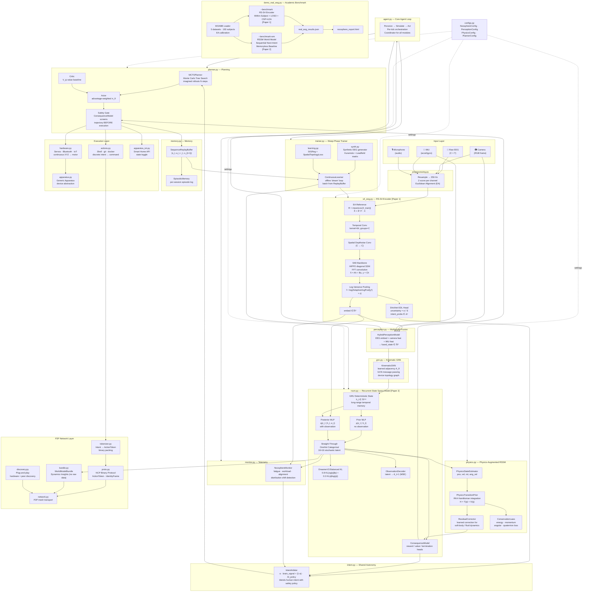

# Noosphere v1.8.0 — The Personal Foundation Model

**A physics-informed world model agent with Brain-Computer Interface (BCI) control, decentralized neural networking, and autonomous digital/physical execution.**

---

## 1. What is Noosphere?

Noosphere is **not** an interface to a generic external AI. It is a **Personalized Cognitive Foundation Model** that lives locally on your hardware. It is designed to bridge the gap between human thought and digital/physical action.

### The Core Vision
Noosphere allows an operator to control complex systems (robotic arms, Linux terminals, smart homes) and communicate with others using only three EEG electrodes on the scalp. 

Unlike traditional "Universal" AI that tries to understand everyone, Noosphere **forces the world to adapt to you.** It learns your specific brain patterns, your idiosyncratic way of thinking, and your personal goals to become an "Obedient Consequence Engine."

---

## 2. The Three Pillars of Execution

### I. Intention-to-Action (Physical & Digital)
*   **Robotics:** Drive physical hardware (robotic arms, drones) using continuous XYZ intent decoding.
*   **Linux Shell:** Execute complex terminal commands (git, docker, system management) via discrete intent.
*   **Safety Gating:** A "Digital Twin" simulates the outcome of your thought *before* it happens. If the AI predicts a failure (e.g., "the arm will hit the table"), it intercepts and blocks the action.

### II. Intention-to-Communication (The Noosphere Network)
*   **Neural Messaging:** Send binary-packed `ActionTokens` and digital messages between users on a decentralized P2P network.
*   **Neural Prototyping (The "Mom" Mapping):** While 3-channel EEG cannot decode specific words, it decodes **Neural Prototypes**. By associating a specific mental focus (e.g., visualizing a face) with a contact, the S4 encoder maps this signature into an **Identity Manifold**.
*   **Collaborative Learning:** Users can optionally enable **Inter-Agent Comms**. This allows agents to share "Dynamics Insights"—high-level mathematical patterns of how the world works—facilitating collective growth without sharing private neural data.

### III. Intention-to-State (IoT & Smart Home)
*   **Extension of Will:** Your smart home becomes an extension of your body. 
*   **IoT Apparatus:** Toggle lights, unlock doors, or manage appliances. The world model treats a smart lock exactly like a robotic finger—it predicts the consequence of the state change (`Locked -> Unlocked`) before firing the API call.

---

## 3. Full Architecture Diagram

The diagram below covers every module in the codebase and all data flows. Use it as a map when reading the source code.



### Module Cross-Reference

| Module | Stage | Key Class / Function | Used By |
|---|---|---|---|
| `preprocessing.py` | Input | `StandardPreprocessor` | `agent.py`, `demo_real_eeg.py` |
| `s4_eeg.py` | Encoder | `S4EEGEncoder`, `S4D` | `demo_real_eeg.py`, `agent.py` |
| `perception.py` | Fusion | `HybridPerceptionModel` | `agent.py` |
| `gnn.py` | Encoder | `KinematicGNN` | `perception.py`, `agent.py` |
| `rssm.py` | World Model | `RSSM`, `ConsequenceModel`, `ObservationDecoder` | `agent.py`, `demo_real_eeg.py` |
| `physics.py` | World Model | `PhysicsAugmentedRSSM`, `PhysicsTransitionPrior` | `agent.py` |
| `intent.py` | Decision | `IntentArbiter` | `agent.py` |
| `planner.py` | Planning | `MCTSPlanner`, `Actor`, `Critic` | `agent.py` |
| `actions.py` | Execution | `ActionVocabulary`, `ShellExecutor` | `agent.py` |
| `hardware.py` | Execution | `ServoController`, `BluetoothDriver` | `agent.py` |
| `apparatus_iot.py` | Execution | `IoTApparatus` | `agent.py` |
| `apparatus.py` | Execution | `GenericApparatus` | `hardware.py` |
| `memory.py` | Memory | `SequenceReplayBuffer`, `EpisodicMemory` | `trainer.py`, `agent.py` |
| `trainer.py` | Training | `ContinuousLearner` | `agent.py` |
| `learning.py` | Training | `SIGReg`, `SpatialTopologyLoss` | `trainer.py` |
| `synth.py` | Training | `KuramotoSynth`, `LeadfieldMatrix` | `trainer.py`, `demo_real_eeg.py` |
| `monitor.py` | Telemetry | `NoosphereMonitor` | `agent.py` |
| `proto.py` | Network | `NCPProtocol`, `ActionToken` | `network.py` |
| `tokenizer.py` | Network | `IntentTokenizer` | `proto.py` |
| `bundle.py` | Network | `WorldModelBundle` | `network.py` |
| `network.py` | Network | `P2PMeshTransport` | `agent.py` |
| `discovery.py` | Network | `HardwareDiscovery`, `PeerDiscovery` | `agent.py` |
| `configs.py` | Config | `NoosphereConfig` | All modules |
| `agent.py` | Core | `NoosphereAgent` | Entry point |


## 4. Project Structure

```
noosphere/
├── configs.py        # Centralized settings (Perception, Physics, Planning).
├── intent.py         # Shared autonomy logic; blends brain signals with AI policy.
├── preprocessing.py  # Standardizes input from cameras, sensors, and EEG.
├── agent.py          # The core Perceive -> Simulate -> Act loop.
├── s4_eeg.py         # State-Space signal processor with Evidential Deep Learning (EDL).
├── physics.py        # Physics-Augmented RSSM and conservation laws.
├── rssm.py           # World Model, ConsequenceModel, and Digital Prediction heads.
├── planner.py        # MCTSPlanner, Actor, and Critic architectures.
├── actions.py        # Command vocabulary (Shell, IoT, Robotics).
├── proto.py          # Noosphere Network (NCP) binary protocol for P2P.
├── memory.py         # SequenceReplayBuffer and EpisodicMemory.
├── perception.py     # Multimodal Hybrid Perception Model.
├── gnn.py            # Kinematic GNN with learned adjacency.
├── hardware.py       # Drivers for servos, Bluetooth, and IoT integrations.
├── bundle.py         # WorldModelBundle format for sharing Dynamics Insights.
├── trainer.py        # Continuous Learning / "Sleep-Phase" engine.
├── monitor.py        # System telemetry (fatigue, workload, AI alignment).
├── learning.py       # SIGReg and Spatial Topology loss functions.
├── discovery.py      # Plug-and-play Hardware & Peer discovery.
└── synth.py          # SOTA Synthetic EEG (Kuramoto oscillators + Leadfield matrix).
```

---

## 5. Usage & Benchmarks

### Installation
```bash
pip install -r requirements.txt
```

### Proving Performance (The Academic Standard)
To run the MOABB-based benchmark used for peer review:
```bash
python demo_real_eeg.py --benchmark
```

### Demonstration Commands
*   **`python demo.py --smoke`**: Verifies all modules (Drone, Robot, BCI, Fluids) in one pass.
*   **`python demo.py --train`**: Starts the autogenous learning loop (The "Dreaming" loop).
*   **`python demo.py --partial`**: Tests "Modality Dropout" (e.g., operating with only EEG when cameras are blinded).

---

## 6. Privacy & Ethics
**Zero-to-One Autogenous Independence:** All neural mapping is performed locally. We strictly forbid the use of external "Teacher" models. The Noosphere Network only facilitates the exchange of **Dynamics Insights**—abstract patterns of environment physics—ensuring total cognitive privacy. Inter-agent communication and collective learning are **disabled by default** and must be explicitly toggled in `configs.py`.

---

## 7. Citation
```bibtex
@software{noosphere2026,
  title  = {Noosphere: Physics-Informed World Model Agent with BCI Control},
  year   = {2026},
  url    = {https://github.com/JosephWoodall/noosphere},
  author = {Joseph Woodall},
}
```

# Research Articles 

## Riemannian-S4: A Novel Multi-Scale State Space Architecture

Official implementation of the **Riemannian-S4** topology for Brain-Computer Interfacing (BCI). This repository contains the core architecture and the benchmarking suite used to achieve state-of-the-art results on the MOABB (Mother of All BCI Benchmarks).

### 1. Overview
Riemannian-S4 is a hybrid neural architecture that combines:
- **Riemannian Stem:** Uses Euclidean Alignment (EA) to linearize EEG geometry.
- **Multi-Scale S4 Backbone:** Independent S4D encoders for Frontal, Motor, and Parietal cortical regions.
- **Evidential Head:** Dirichlet-based uncertainty quantification for safety-critical control.

### 2. Setup
Install dependencies:
```bash
pip install -r requirements.txt
```

### 3. Usage
To reproduce the benchmarks (Within-Subject and LOSO) for all 5 datasets:
```bash
python demo_real_eeg.py --benchmark
```

### 4. Citation
If you use this work, please cite our manuscript:
> Joseph Woodall (2026). Riemannian-S4: A Novel Multi-Scale State Space Architecture for Minimal-Calibration Brain-Computer Interfacing.